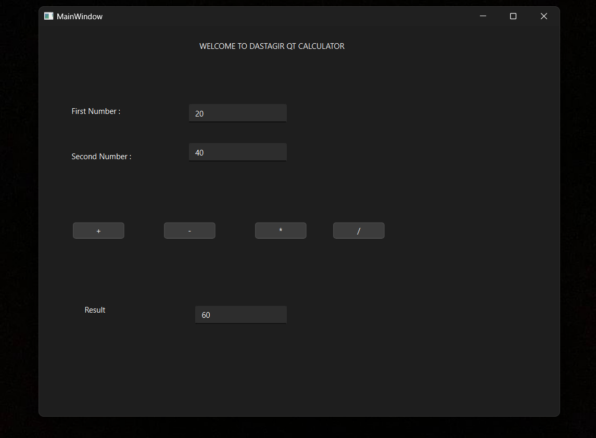

# Qt Calculator

A simple calculator application developed using the Qt framework and C++. This project was created using Qt Creator.

## Features

- Basic arithmetic operations: addition, subtraction, multiplication, and division.
- Clear and intuitive user interface.
- Error handling for division by zero and other invalid operations.

## Screenshots



## Getting Started

### Prerequisites

To build and run this project, you need the following software installed:

- [Qt](https://www.qt.io/download) (version 5.15 or later recommended)
- [Qt Creator](https://www.qt.io/product/development-tools) (optional but recommended for an integrated development environment)

### Building the Project

1. Clone this repository:
    ```sh
    git clone https://github.com/yourusername/qt-calculator.git
    cd qt-calculator
    ```

2. Open the project in Qt Creator:
    - Launch Qt Creator.
    - Click on `File > Open File or Project`.
    - Navigate to the cloned repository and open the `.pro` file.

3. Build and run the project:
    - Click on the `Run` button in Qt Creator to build and run the application.

### Usage

- Use the buttons on the calculator interface to perform arithmetic operations.
- The display shows the current input and result of the operations.
- Click the `C` button to clear the current input.

## Contributing

Contributions are welcome! If you have any suggestions or improvements, feel free to open an issue or submit a pull request.

## License

This project is licensed under the MIT License. See the [LICENSE](LICENSE) file for details.

## Acknowledgements

- The Qt Project for providing an excellent framework for cross-platform development.
